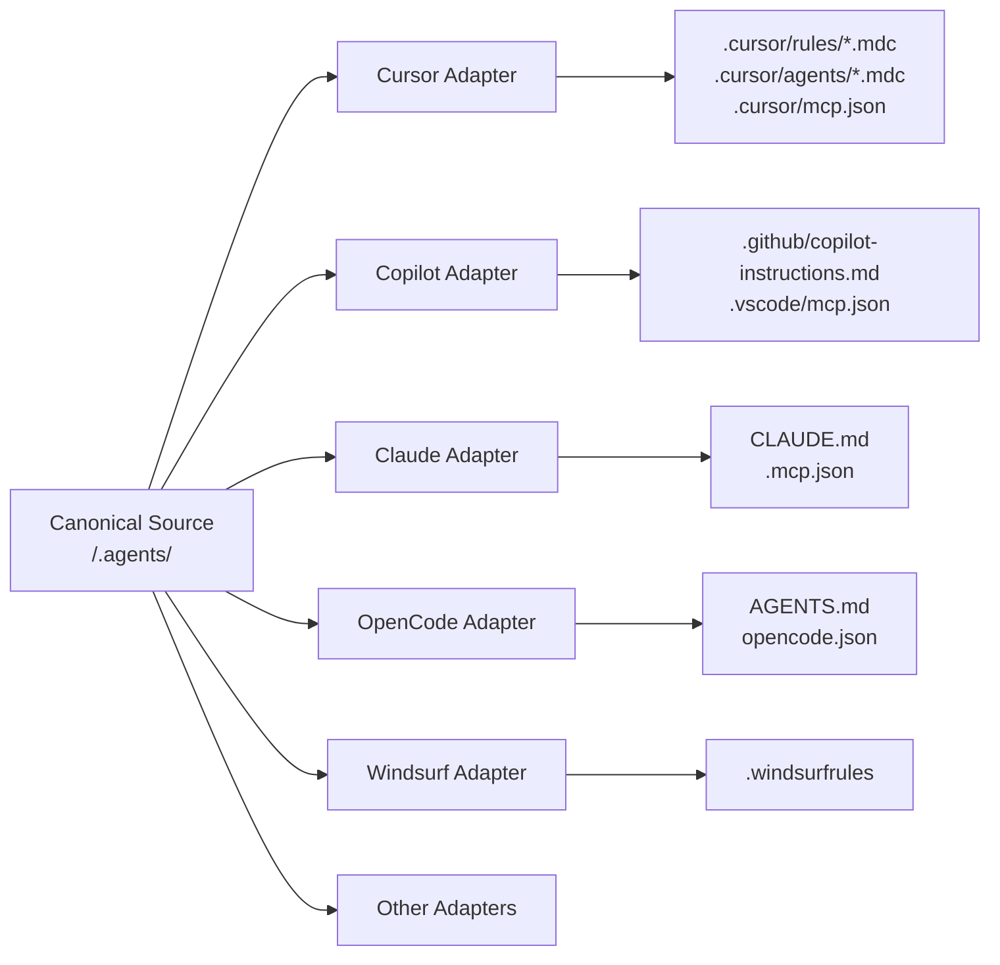

Adapters transform hatch3r's canonical source (`/.agents/`) into native configuration for each AI coding tool. This design ensures consistency across tools while respecting each tool's conventions.

## Adapter Architecture



### Canonical Source Structure

All adapters read from the same source:

```
/.agents/
  ├── agents/           # 15 specialized agents (*.md)
  ├── skills/           # 25 composable workflows (SKILL.md)
  ├── rules/            # 22 coding standards (*.md)
  ├── commands/         # 29 orchestration commands (*.md)
  ├── mcp/              # MCP server configs (mcp.json)
  ├── AGENTS.md         # Bridge file for tools without native agent support
  └── hatch.json        # Manifest (board config, model preferences)
```

Each markdown file includes YAML frontmatter:

```yaml
---
id: hatch3r-implementer
type: agent
description: Focused implementation agent for a single issue
model: sonnet  # optional: model override
scope: always  # for rules: always, on-request, contextual
---
```

## Adapter Implementations

### Cursor Adapter

**Source**: `src/adapters/cursor.ts`

**Outputs**:

```
.cursor/
  ├── rules/
  │   ├── hatch3r-code-standards.mdc
  │   ├── hatch3r-error-handling.mdc
  │   └── ...(22 total)
  ├── agents/
  │   ├── hatch3r-implementer.mdc
  │   ├── hatch3r-researcher.mdc
  │   └── ...(15 total)
  └── mcp.json
```

**Mapping**:
- Rules → `.cursor/rules/{id}.mdc` (Cursor's native rule format)
- Agents → `.cursor/agents/{id}.mdc` (Cursor's native agent format)
- Skills → Embedded in agents (no native skill format)
- Commands → Embedded in agents (no native command format)
- MCP → `.cursor/mcp.json` (project-level takes precedence over `~/.cursor/mcp.json`)

**Model configuration**: Via frontmatter `model: sonnet` in `.mdc` files

**Managed blocks**: All `.mdc` files use `<!-- HATCH3R:BEGIN -->` / `<!-- HATCH3R:END -->` markers

### Copilot Adapter

**Source**: `src/adapters/copilot.ts`

**Outputs**:

```
.github/
  └── copilot-instructions.md   # All rules, agents, skills, commands
.vscode/
  └── mcp.json                   # MCP server config
```

**Mapping**:
- All content → Single `.github/copilot-instructions.md` (no native separation)
- Rules organized by category with headings
- Agents embedded as "Delegation Protocols"
- Skills embedded as "Workflow Guides"
- Commands embedded as "Orchestration Commands"
- MCP → `.vscode/mcp.json` with `envFile` for secret loading

**Model configuration**: Not supported (Copilot uses fixed models)

**Managed blocks**: Uses `<!-- HATCH3R:BEGIN -->` / `<!-- HATCH3R:END -->` in `copilot-instructions.md`

### Claude Code Adapter

**Source**: `src/adapters/claude.ts`

**Outputs**:

```
CLAUDE.md        # All rules, agents, skills, commands
.mcp.json        # MCP server config
```

**Mapping**:
- All content → Single `CLAUDE.md` at project root
- Structured with clear sections: Rules, Agents, Skills, Commands
- MCP → `.mcp.json` at project root (Claude's expected location)

**Model configuration**: Not directly supported (set via Claude Desktop settings)

**Managed blocks**: Uses `<!-- HATCH3R:BEGIN -->` / `<!-- HATCH3R:END -->` in `CLAUDE.md`

### OpenCode Adapter

**Source**: `src/adapters/opencode.ts`

**Outputs**:

```
AGENTS.md        # All agents, skills, rules, commands
opencode.json    # Tool configuration
.mcp.json        # MCP server config
```

**Mapping**:
- All content → `AGENTS.md` at project root (OpenCode's expected format)
- Agents listed with delegation protocols
- Skills embedded in relevant agents
- Rules organized by scope
- Commands as invocable workflows
- MCP → `.mcp.json` at project root

**Model configuration**: Via `opencode.json`

**Managed blocks**: Uses `<!-- HATCH3R:BEGIN -->` / `<!-- HATCH3R:END -->` in `AGENTS.md`

### Windsurf Adapter

**Source**: `src/adapters/windsurf.ts`

**Outputs**:

```
.windsurfrules   # All rules, agents, skills, commands
```

**Mapping**:
- All content → Single `.windsurfrules` file (Windsurf's expected format)
- Flat structure with all instructions
- No native MCP support (use system-level MCP config)

**Model configuration**: Not supported (Windsurf uses fixed models)

**Managed blocks**: Uses `<!-- HATCH3R:BEGIN -->` / `<!-- HATCH3R:END -->` in `.windsurfrules`

### Other Adapters

hatch3r includes adapters for:

- **Amp**: `AGENTS.md` format
- **Codex CLI**: `AGENTS.md` + `codex.md`
- **Gemini CLI**: `GEMINI.md`
- **Cline / Roo Code**: `.clinerules` + `.cursorrules` (fallback)
- **Aider**: `.aider.conf.yml`
- **Goose**: `goose.yaml`
- **Kiro**: `.kiro/agents.md`
- **Zed**: `.zed/settings.json`

See `src/adapters/` for implementation details.

## Adapter Capability Matrix

| Feature | Cursor | Copilot | Claude | OpenCode | Windsurf |
|---------|--------|---------|--------|----------|----------|
| **Native rules** | ✓ (.mdc) | ✗ (merged) | ✗ (merged) | ✗ (merged) | ✗ (merged) |
| **Native agents** | ✓ (.mdc) | ✗ (embedded) | ✗ (embedded) | ✓ (AGENTS.md) | ✗ (embedded) |
| **Native skills** | ✗ (embedded) | ✗ (embedded) | ✗ (embedded) | ✗ (embedded) | ✗ (embedded) |
| **Native commands** | ✗ (embedded) | ✗ (embedded) | ✗ (embedded) | ✗ (embedded) | ✗ (embedded) |
| **MCP support** | ✓ (project) | ✓ (.vscode) | ✓ (project) | ✓ (project) | ✗ (system) |
| **Model config** | ✓ (frontmatter) | ✗ | ✗ | ✓ (json) | ✗ |
| **Managed blocks** | ✓ | ✓ | ✓ | ✓ | ✓ |
| **Auto secrets** | ✗ (manual) | ✓ (envFile) | ✗ (manual) | ✗ (manual) | N/A |

## How Adapters Work

### Reading Canonical Files

All adapters use `src/adapters/canonical.ts` to read the canonical source:

```typescript
import { readCanonicalFiles } from './canonical.js';

const rules = await readCanonicalFiles(agentsDir, 'rules');
const agents = await readCanonicalFiles(agentsDir, 'agents');
const skills = await readCanonicalFiles(agentsDir, 'skills');
const commands = await readCanonicalFiles(agentsDir, 'commands');
```

Each file's frontmatter is parsed into structured metadata:

```typescript
interface CanonicalFile {
  id: string;
  type: 'rule' | 'agent' | 'skill' | 'command';
  description: string;
  scope?: 'always' | 'on-request' | 'contextual';  // for rules
  model?: string;  // for agents
  content: string;  // markdown body
  rawContent: string;  // full file with frontmatter
  sourcePath: string;
}
```

### Generating Tool-Specific Outputs

Each adapter implements:

```typescript
export async function generate(
  projectRoot: string,
  agentsDir: string,
  config: HatchConfig
): Promise<void> {
  // 1. Read canonical files
  const rules = await readCanonicalFiles(agentsDir, 'rules');
  const agents = await readCanonicalFiles(agentsDir, 'agents');
  
  // 2. Transform to tool-specific format
  const output = transformForTool(rules, agents, config);
  
  // 3. Write with managed blocks
  await writeWithManagedBlocks(outputPath, output);
}
```

### Managed Blocks

All adapters use managed blocks to preserve custom content:

```markdown
<!-- HATCH3R:BEGIN -->
...generated content (updated on sync/update)...
<!-- HATCH3R:END -->

## My Custom Section
...never overwritten...
```

When regenerating, adapters:
1. Read existing file
2. Extract content between `<!-- HATCH3R:BEGIN -->` and `<!-- HATCH3R:END -->`
3. Replace only managed content
4. Preserve everything outside markers

## Sync Workflow

The `hatch3r sync` command regenerates all tool-specific outputs from canonical source:

```bash
npx hatch3r sync
```

**Process**:
1. Read `hatch.json` to determine enabled tools
2. For each enabled tool, invoke its adapter's `generate()` function
3. Preserve custom content outside managed blocks
4. Update only content within managed blocks

**Safe to run anytime** — custom content is never lost.

## Update Workflow

The `hatch3r update` command pulls latest templates from the hatch3r package:

```bash
npx hatch3r update
```

**Process**:
1. Fetch latest canonical files from `hatch3r` package
2. Merge new/changed files into `/.agents/`
3. Run `hatch3r sync` to regenerate tool outputs
4. Preserve custom content in both canonical and generated files

**Safe merge** — no destructive overwrites.

## Adding a New Adapter

To add support for a new tool:

1. **Create adapter file**: `src/adapters/my-tool.ts`
2. **Implement generate function**:
   ```typescript
   export async function generate(
     projectRoot: string,
     agentsDir: string,
     config: HatchConfig
   ): Promise<void> {
     const rules = await readCanonicalFiles(agentsDir, 'rules');
     // Transform to your tool's format
     // Write with managed blocks
   }
   ```
3. **Register in adapter index**: `src/adapters/index.ts`
4. **Add tool detection**: Update `hatch3r init` to detect the new tool
5. **Test**: Verify `sync` and `update` preserve custom content

See existing adapters in `src/adapters/` for reference implementations.

## Next Steps

<CardGroup cols={2}>
  <Card title="Customization" icon="sliders" href="/customize/overview">
    Learn how to customize agents, skills, rules, and commands per project
  </Card>
  <Card title="CLI Reference" icon="terminal" href="/cli/sync">
    Explore sync, update, status, and validate commands
  </Card>
  <Card title="Architecture" icon="compass-drafting" href="/concepts/overview">
    Understand the canonical source architecture
  </Card>
  <Card title="Contributing" icon="code-pull-request" href="/contributing">
    Add support for a new tool or improve existing adapters
  </Card>
</CardGroup>