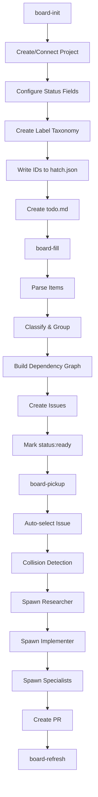

hatch3r provides a complete board management system for GitHub-based workflows. The four core commands (`board-init`, `board-fill`, `board-pickup`, `board-refresh`) handle everything from project creation to parallel sub-agent execution.

## The Board Management Workflow



## board-init: Bootstrap Your Board

**Purpose**: Create or connect a GitHub Projects V2 board with full configuration.

### What It Does

1. **Project Creation/Connection**
   - Creates a new GitHub Projects V2 board via GraphQL
   - OR connects to an existing project (you provide project number)
   - Prompts for project name, description, visibility (private/public)

2. **Status Field Configuration**
   - Creates 5 default status columns:
     - **Backlog**: Not yet ready for work
     - **Ready**: All blockers satisfied, ready to pick up
     - **In Progress**: Currently being worked on
     - **In Review**: PR open, awaiting review
     - **Done**: Merged and closed
   - Writes status option IDs to `hatch.json` for later sync

3. **Label Taxonomy Creation**
   - **Type labels**: `type:bug`, `type:feature`, `type:refactor`, `type:qa`, `type:docs`, `type:infra`
   - **Executor labels**: `executor:agent`, `executor:hybrid`, `executor:human`
   - **Status labels**: `status:triage`, `status:ready`, `status:in-progress`, `status:in-review`, `status:blocked`
   - **Priority labels**: `priority:p0`, `priority:p1`, `priority:p2`, `priority:p3`
   - **Risk labels**: `risk:low`, `risk:med`, `risk:high`
   - **Meta labels**: `meta:epic`, `meta:board-overview`, `meta:finding`
   - **Area labels**: User-defined (e.g., `area:frontend`, `area:backend`, `area:infra`)

4. **Default Branch Configuration**
   - Prompts for default branch name (`main` or `master`)
   - Used by `board-pickup` for branch creation and PR base

5. **Optional Migration**
   - Can migrate issues from another GitHub project
   - Preserves issue content, labels, assignees

6. **Persist Configuration**
   - Writes all IDs to `hatch.json`:
   ```json
   {
     "board": {
       "owner": "my-org",
       "repo": "my-repo",
       "projectNumber": 1,
       "defaultBranch": "main",
       "statusOptions": {
         "backlog": "Backlog",
         "ready": "Ready",
         "inProgress": "In Progress",
         "inReview": "In Review",
         "done": "Done"
       },
       "areas": ["area:frontend", "area:backend", "area:infra"]
     }
   }
   ```

### Invocation

```bash
# In Cursor or other tools
/hatch3r board-init

# Or natural language
"initialize the board"
"set up GitHub project"
```

**All mutations require user confirmation** — board-init never makes changes without asking.

---

## board-fill: Populate the Board

**Purpose**: Parse `todo.md` and create GitHub issues with dependency analysis and implementation order.

### What It Does

1. **Read `todo.md`**
   - One item per line
   - Supports plain text, markdown checkboxes, or structured format
   - Example:
   ```markdown
   # todo.md
   Add dark mode toggle to settings page
   Fix login bug when email contains plus sign
   Refactor authentication middleware for better testability
   Epic: Implement real-time notifications
     - Set up WebSocket server
     - Update frontend to subscribe to events
     - Add notification persistence layer
   ```

2. **Deduplicate**
   - Search existing issues for similar titles/content
   - Skip creating duplicates
   - Report deduplication results to user

3. **Classify Each Item**
   - **Type**: Bug, feature, refactor, QA, docs, infra (inferred from wording)
   - **Executor**: Agent (default), hybrid, or human (user can override)
   - **Priority**: P0-P3 (inferred from keywords like "critical", "urgent", "nice-to-have")
   - **Area**: Frontend, backend, infra, etc. (inferred from context)
   - **Risk**: Low, medium, high (based on complexity, scope, dependencies)

4. **Group Into Epics**
   - Items indented under "Epic: ..." become sub-issues
   - Epic issue created with `meta:epic` label
   - Sub-issues linked to epic via GitHub sub-issue relationship

5. **Build Dependency Graph**
   - Parse dependency syntax in `todo.md`:
     ```markdown
     Set up CI pipeline [after database migration]
     Deploy to production [blocked by QA validation]
     ```
   - Analyze code dependencies (files touched, modules affected)
   - Build directed acyclic graph (DAG)

6. **Determine Implementation Order**
   - Topological sort of dependency graph
   - Group items by dependency level (Level 1: no blockers, Level 2: depends on Level 1, etc.)
   - Identify parallel work lanes (items with no mutual dependencies)
   - Write `## Implementation Order` section in epic body:
   ```markdown
   ## Implementation Order
   
   **Level 1** (can start immediately):
   - #5 Set up WebSocket server
   
   **Level 2** (after Level 1):
   - #6 Update frontend to subscribe to events
   - #7 Add notification persistence layer (parallel with #6)
   
   **Level 3** (after Level 2):
   - #8 End-to-end notification testing
   ```

7. **Mark `status:ready`**
   - Issues with no unsatisfied blockers → `status:ready`
   - Issues with blockers → `status:triage` (moved to `status:ready` when blockers close)

8. **Create Issues**
   - Create GitHub issues via `gh` CLI (primary) or GitHub MCP (fallback)
   - Apply labels, link to epics, add dependency annotations
   - Add to Projects V2 board with appropriate status

### Invocation

```bash
/hatch3r board-fill

# Or natural language
"fill the board from todo.md"
"create issues from the todo list"
```

**Reads project documentation and codebase context** to produce well-scoped issues with accurate estimates and dependencies.

---

## board-pickup: Execute Work

**Purpose**: Pick up the next best issue(s) from the board, spawn sub-agents, and create a PR.

### Workflow Overview

**10 Steps**:

1. **List available work** (dependency-aware, priority-sorted)
2. **Scope selection** (single, epic, sub-issue, batch)
3. **Collision detection** (in-progress issues, open PRs)
4. **Update issue status** (`status:in-progress`)
5. **Branch creation** (`{type}/{short-description}`)
6. **Delegate implementation** (researcher → implementer → specialists)
7. **Quality verification** (lint, typecheck, tests)
8. **Commit & push**
9. **Create PR** with full board sync
10. **Capture learnings**

See [board-pickup command](/commands/board-pickup) for detailed step-by-step workflow.

### Key Features

#### Dependency-Aware Selection

- **Analyzes dependency graph** from `board-fill`
- **Auto-selects next best issue** based on:
  1. All hard blockers satisfied
  2. `status:ready` (not `status:triage` or `status:blocked`)
  3. `executor:agent` or `executor:hybrid` (skip `executor:human`)
  4. Highest priority (P0 > P1 > P2 > P3)
  5. Most downstream unblocking (picking this unblocks the most other issues)

- **Presents available work in tiers**:
  ```
  Available Work (ready + unblocked):
    Epic #10 — Implement real-time notifications [status:in-progress]
      Next up: #12 — Update frontend to subscribe to events [executor:agent] [after #11 ✓]
  
    Independent (parallelizable):
      #15 — Fix login bug [type:bug] [executor:agent] [priority:p1] [no blockers]
      #18 — Add dark mode toggle [type:feature] [executor:agent] [priority:p2] [no blockers]
  
  Waiting on Dependencies (hard blockers unsatisfied):
      #20 — Deploy to production [blocked by #19 (open)]
  ```

#### Collision Detection

- **In-progress issues**: Search for `label:status:in-progress state:open`
- **Open PRs**: Search for `state:open` pull requests
- **Overlap analysis**:
  - **Hard collision**: Same problem or overlapping files
  - **Soft collision**: Related work, adjacent modules
  - **No collision**: Independent work
- **Intra-batch overlap**: When picking multiple issues as a batch, checks if they touch the same files
  - If collision detected, moves conflicting issues to sequential dependency levels

#### Batch Mode

Pick up **multiple independent issues in parallel**:

```bash
# Explicit batch
"pick up #1, #3, #7"
"batch pick up the next 4 issues"

# Auto-batch (auto-advance mode)
/hatch3r board-pickup --auto --max-batch=4
```

**Batch workflow**:
1. Group issues by dependency level (independent issues → Level 1)
2. Spawn one `hatch3r-researcher` per issue (parallel)
3. Spawn one `hatch3r-implementer` per issue per level (parallel within level, sequential across levels)
4. Spawn specialists across entire batch after all implementations complete
5. Single shared branch, combined PR listing all issues

**Branch naming**: `batch/{short-description}` or `{type}/batch-{description}` if all share same type

**Commit message**: `batch: {short description} (#1, #3, #7)`

**PR body**: Lists `Closes #N` for every issue in batch, with per-issue summary

#### Sub-Agentic Delegation

Every implementation follows the **mandatory three-phase pipeline** (from `agent-orchestration` rule):

**Phase 1 — Research** (skip only for trivial single-line edits):
- Spawn `hatch3r-researcher` via Task tool
- Modes by issue type:
  - `type:bug`: `symptom-trace`, `root-cause`, `codebase-impact`
  - `type:feature`: `codebase-impact`, `feature-design`, `architecture`
  - `type:refactor`: `current-state`, `refactoring-strategy`, `migration-path`
- Depth by risk: `quick` (low), `standard` (med), `deep` (high)

**Phase 2 — Implement**:
- Spawn `hatch3r-implementer` via Task tool (one per issue/sub-issue)
- Include researcher output, issue context, specs, rules, learnings
- Implementer follows issue-type skill (bug-fix, feature, refactor, qa-validation)
- Returns structured result (files changed, tests written, issues encountered)

**Phase 3 — Quality**:
- Spawn specialists in parallel (maximum concurrency):
  - **Always**: `hatch3r-reviewer`, `hatch3r-test-writer`, `hatch3r-security-auditor`
  - **Evaluate**: `hatch3r-docs-writer` (when APIs/architecture/behavior changes)
  - **Conditional**: `hatch3r-lint-fixer`, `hatch3r-a11y-auditor`, `hatch3r-perf-profiler`
- Await all, apply feedback before PR creation

See [Sub-Agentic Architecture](/concepts/sub-agentic-architecture) for delegation patterns.

#### Auto-Advance Mode

Sustained autonomous operation with reduced checkpoints:

```bash
/hatch3r board-pickup --auto --max-issues=10 --cost-limit=20 --max-batch=4
```

**Behavior changes**:
- **Issue selection**: Auto-select highest priority ready issue(s), **auto-batch** up to `--max-batch` independent issues
- **Specification generation**: Auto-generate and attach, skip validation
- **Implementation plan**: Auto-proceed with plan
- **PR creation**: Auto-create PR
- **Next issue**: Auto-advance to next after PR creation

**Safety guardrails** (always active, even in auto mode):
- Destructive operations require confirmation
- Breaking changes require confirmation
- Cost threshold: stop if estimated cost > $10 per issue (configurable)
- Error threshold: stop after 3 consecutive failures
- Scope limit: max 10 issues per session (configurable)

**Session report**:
```
Issues completed: 7
Issues batched: 4 (batch 1), 3 (batch 2)
PRs created: #45, #46
Issues blocked: #20 (waiting on #19)
Total estimated cost: $8.50
Learnings captured: 2
```

---

## board-refresh: Dashboard Updates

**Purpose**: Regenerate the living board overview dashboard on demand.

### What It Does

1. **Scan all open and recently closed issues**
   - Read issue metadata (labels, status, dependencies, epic relationships)
   - Use cached data from `board-pickup` when available (no re-fetch)

2. **Compute board health metrics**:
   - **Missing metadata**: Issues without type/priority/area labels
   - **Stale issues**: Open > 30 days with no activity
   - **Blocked dependency chains**: Circular dependencies, orphaned blockers
   - **Readiness violations**: Issues marked `status:ready` but with unsatisfied blockers

3. **Assign recommended models**
   - Quality-first heuristic:
     - P0 + high risk → `opus`
     - Security/architecture issues → `opus`
     - Low-risk, well-scoped → `sonnet`
   - Include `Recommended Model` column in issue listings

4. **Update `meta:board-overview` issue**
   - Current status tables (Available, Blocked, Not Ready)
   - Epic progress with sub-issue completion percentage
   - Health diagnostics with actionable recommendations
   - Auto-creates `meta:board-overview` issue if it doesn't exist

### Invocation

```bash
/hatch3r board-refresh

# Or automatically at end of board-pickup
```

**No user prompts required** — fully autonomous.

**Mandatory** at end of `board-pickup` Step 9a (uses cached data, no performance impact).

---

## board-shared: Shared Context

**Purpose**: Shared context and procedures referenced by all board commands.

**Provides**:

1. **Board Configuration** (from `hatch.json`):
   - Owner, repo, project number
   - Default branch
   - Status option IDs
   - Area labels

2. **GitHub Context**:
   - Projects V2 GraphQL operations
   - Label taxonomy definitions

3. **Projects V2 Sync Procedure**:
   - Add item to project (`gh project item-add`)
   - Capture `item_id` from response
   - Update status field (`gh project item-edit --field-id {statusFieldId} --value {statusOptionId}`)
   - Use `gh` CLI (primary), fallback to GraphQL if `gh` unavailable

4. **Tooling Directives**:
   - `gh` CLI-first for all GitHub operations
   - GitHub MCP fallback for Projects V2 mutations not covered by `gh`

5. **Token-Saving Guidelines**:
   - Cache board data, reuse across steps
   - Don't re-fetch issues already in context
   - Use grep/glob for codebase exploration (not full file reads)

**Not invoked directly** — loaded by `board-init`, `board-fill`, `board-pickup`, `board-refresh`.

---

## Complete Workflow Example

### Initial Setup

```bash
# 1. Initialize board
/hatch3r board-init
# Creates project, configures labels, writes IDs to hatch.json

# 2. Create todo.md
cat > todo.md <<EOF
Epic: Real-time notifications
  Set up WebSocket server
  Update frontend to subscribe to events
  Add notification persistence layer
  E2E notification testing

Add dark mode toggle to settings
Fix login bug with plus sign in email
EOF

# 3. Fill board
/hatch3r board-fill
# Creates epic #10 with sub-issues #11-#14, standalone issues #15-#16
# Analyzes dependencies, marks #11 as status:ready
```

### Development Cycle

```bash
# 4. Pick up next issue
/hatch3r board-pickup
# Auto-selects #11 (WebSocket server), creates branch feat/websocket-server
# Spawns researcher → implementer → specialists
# Creates PR #17, marks #11 status:in-review

# 5. Merge PR #17
# GitHub auto-closes #11, transitions to Done
# #12 and #13 now status:ready (blocker satisfied)

# 6. Pick up batch
"batch pick up #12 and #13"
# Creates branch batch/frontend-notifications
# Spawns 2 researchers (parallel) → 2 implementers (parallel) → specialists
# Creates PR #18 with "Closes #12, Closes #13"
```

### Monitoring

```bash
# 7. Refresh dashboard
/hatch3r board-refresh
# Updates meta:board-overview issue with:
# - Epic #10: 50% complete (2/4 sub-issues done)
# - Available: #14, #15, #16
# - Health: 1 stale issue (#16, 45 days old)
```

---

## Best Practices

1. **Run `board-init` once per repository** — all IDs persisted in `hatch.json`
2. **Keep `todo.md` up to date** — re-run `board-fill` when adding new work
3. **Use auto-advance mode for sustained work** — `--auto --max-batch=4` picks up multiple issues per session
4. **Review `meta:board-overview` regularly** — identifies stale issues, blocked chains, missing metadata
5. **Let `board-pickup` auto-select** — dependency analysis ensures optimal order
6. **Use batch mode for independent issues** — maximize parallelism
7. **Capture learnings** — Step 10 of `board-pickup` creates reusable knowledge

## Next Steps

<CardGroup cols={2}>
  <Card title="Commands" icon="terminal" href="/concepts/commands">
    Explore all 29 orchestration commands
  </Card>
  <Card title="Sub-Agentic Architecture" icon="sitemap" href="/concepts/sub-agentic-architecture">
    Understand parallel delegation and dependency-aware orchestration
  </Card>
  <Card title="Planning" icon="lightbulb" href="/guides/planning">
    Master feature-plan, bug-plan, refactor-plan workflows
  </Card>
  <Card title="MCP Setup" icon="plug" href="/guides/mcp-setup">
    Configure GitHub MCP for board operations
  </Card>
</CardGroup>